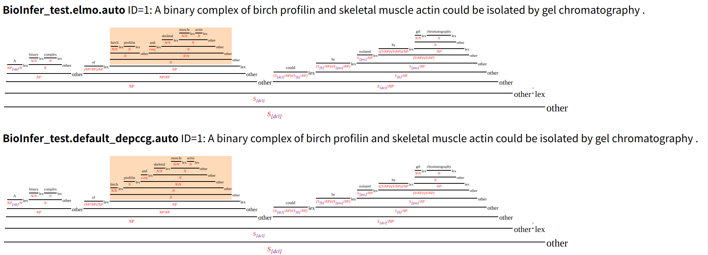

# depccg v2

Codebase for [A\* CCG Parsing with a Supertag and Dependency Factored Model](https://arxiv.org/abs/1704.06936)

## 2021/07/12 Updates (v2)

- Increased stability and efficiency
  - (Replaced OpenMP with multiprocessing)
- More integration with AllenNLP
  - The parser is now callable from within a `predictor` (see [here](#train-your-own-parsing-model))
- More friendly way to define your own grammar (wrt. languages or treebanks)
  - See `depccg/grammar/{en,ja}.py` for example grammars.

## Requirements

- Python >= 3.6.0
- A C++ compiler supporting [C++11 standard](https://en.wikipedia.org/wiki/C%2B%2B11) (in case of gcc, must be >= 4.8)

## Installation

Using pip:

```sh
➜ pip install cython numpy depccg
```

## Usage

### Using a pretrained English parser

Currently following models are available for English:

|Name| Description | unlabeled/labeled F1 on CCGbank| Download |
|:-|:-|:-|:-|
| basic |model trained on the combination of CCGbank and tri-training dataset (Yoshikawa et al., 2017)|94.0%/88.8%| [link](https://drive.google.com/file/d/1mxl1HU99iEQcUYhWhvkowbE4WOH0UKxv/view?usp=sharing) (189M) |
| `elmo` | basic model with its embeddings replaced with ELMo (Peters et al., 2018) |94.98%/90.51%| [link](https://drive.google.com/file/d/1UldQDigVq4VG2pJx9yf3krFjV0IYOwLr/view?usp=sharing) (649M) |
| `rebank` | basic model trained on Rebanked CCGbank (Honnibal et al., 2010) | - | [link](https://drive.google.com/file/d/1Az840uCW8QuAkNCZq_Y8VOkW5j0Vtcj9/view) (337M) |
| `elmo_rebank` |ELMo model trained on Rebanked CCGbank | - | [link](https://drive.google.com/open?id=1deyCjSgCuD16WkEhOL3IXEfQBfARh_ll) (1G) |

The basic model is available by:

```sh
➜ depccg_en download
```

To use:

```sh
➜ echo "this is a test sentence ." | depccg_en
ID=1, Prob=-0.0006299018859863281
(<T S[dcl] 0 2> (<T S[dcl] 0 2> (<L NP XX XX this NP>) (<T S[dcl]\NP 0 2> (<L (S[dcl]\NP)/NP XX XX is (S[dcl]\NP)/NP>) (<T NP 0 2> (<L NP[nb]/N XX XX a NP[nb]/N>) (<T N 0 2> (<L N/N XX XX test N/N>) (<L N XX XX sentence N>) ) ) ) ) (<L . XX XX . .>) )
```

You can download other models by specifying their names:

```sh
➜ depccg_en download elmo
```

To use, make sure to install [allennlp](https://github.com/allenai/allennlp):

```sh
➜ echo "this is a test sentence ." | depccg_en --model elmo
```

You can also specify in the `--model` option the path of a model file (in tar.gz) that is available from links above.

Using a GPU (by `--gpu` option) is recommended if possible.

There are several output formats (see [below](#available-output-formats)).

```sh
➜ echo "this is a test sentence ." | depccg_en --format deriv
ID=1, Prob=-0.0006299018859863281
 this        is           a      test  sentence  .
  NP   (S[dcl]\NP)/NP  NP[nb]/N  N/N      N      .
                                ---------------->
                                       N
                      -------------------------->
                                  NP
      ------------------------------------------>
                      S[dcl]\NP
------------------------------------------------<
                     S[dcl]
---------------------------------------------------<rp>
                      S[dcl]
```

By default, the input is expected to be pre-tokenized. If you want to process untokenized sentences, you can pass `--tokenize` option.

The POS and NER tags in the output are filled with `XX` by default. You can replace them with ones predicted using [SpaCy](https://spacy.io):

```sh
➜ echo "this is a test sentence ." | depccg_en --annotator spacy
ID=1, Prob=-0.0006299018859863281
(<T S[dcl] 0 2> (<T S[dcl] 0 2> (<L NP DT DT this NP>) (<T S[dcl]\NP 0 2> (<L (S[dcl]\NP)/NP VBZ VBZ is (S[dcl]\NP)/NP>) (<T NP 0 2> (<L NP[nb]/N DT DT a NP[nb]/N>) (<T N 0 2> (<L N/N NN NN test N/N>) (<L N NN NN sentence N>) ) ) ) ) (<L . . . . .>) )
```

The parser uses a SpaCy's `en_core_web_sm` model.

Orelse, you can use POS/NER taggers implemented in [C&C](https://www.cl.cam.ac.uk/~sc609/candc-1.00.html), which may be useful in some sorts of parsing experiments:

```sh
➜ export CANDC=/path/to/candc
➜ echo "this is a test sentence ." | depccg_en --annotator candc
ID=1, log prob=-0.0006299018859863281
(<T S[dcl] 0 2> (<T S[dcl] 0 2> (<L NP DT DT this NP>) (<T S[dcl]\NP 0 2> (<L (S[dcl]\NP)/NP VBZ VBZ is (S[dcl]\NP)/NP>) (<T NP 0 2> (<L NP[nb]/N DT DT a NP[nb]/N>) (<T N 0 2> (<L N/N NN NN test N/N>) (<L N NN NN sentence N>) ) ) ) ) (<L . . . . .>) )
```

By default, depccg expects the POS and NER models are placed in `$CANDC/models/pos` and `$CANDC/models/ner`, but you can explicitly specify them by setting `CANDC_MODEL_POS` and `CANDC_MODEL_NER` environmental variables.

It is also possible to obtain logical formulas using [ccg2lambda](https://github.com/mynlp/ccg2lambda)'s semantic parsing algorithm.

```sh
➜ echo "This is a test sentence ." | depccg_en --format ccg2lambda --annotator spacy
ID=0 log probability=-0.0006299018859863281
exists x.(_this(x) & exists z1.(_sentence(z1) & _test(z1) & (x = z1)))
```

### Using a pretrained Japanese parser

The best performing model is available by:

```sh
➜ depccg_ja download
```

It can be downloaded directly [here](https://drive.google.com/file/d/1bblQ6FYugXtgNNKnbCYgNfnQRkBATSY3/view?usp=sharing) (56M).

The parser provides the almost same interface as with the English one, with slight differences including the default output format, which is now one compatible with the Japanese CCGbank:

```sh
➜ echo "これはテストの文です。" | depccg_ja
ID=1, Prob=-53.98793411254883
{< S[mod=nm,form=base,fin=t] {< S[mod=nm,form=base,fin=f] {< NP[case=nc,mod=nm,fin=f] {NP[case=nc,mod=nm,fin=f] これ/これ/**} {NP[case=nc,mod=nm,fin=f]\NP[case=nc,mod=nm,fin=f] は/は/**}} {< S[mod=nm,form=base,fin=f]\NP[case=nc,mod=nm,fin=f] {< NP[case=nc,mod=nm,fin=f] {< NP[case=nc,mod=nm,fin=f] {NP[case=nc,mod=nm,fin=f] テスト/テスト/**} {NP[case=nc,mod=nm,fin=f]\NP[case=nc,mod=nm,fin=f] の/の/**}} {NP[case=nc,mod=nm,fin=f]\NP[case=nc,mod=nm,fin=f] 文/文/**}} {(S[mod=nm,form=base,fin=f]\NP[case=nc,mod=nm,fin=f])\NP[case=nc,mod=nm,fin=f] です/です/**}}} {S[mod=nm,form=base,fin=t]\S[mod=nm,form=base,fin=f] 。/。/**}}
```

You can pass pre-tokenized sentences as well:

```sh
➜ echo "これ は テスト の 文 です 。" | depccg_ja --pre-tokenized
ID=1, Prob=-53.98793411254883
{< S[mod=nm,form=base,fin=t] {< S[mod=nm,form=base,fin=f] {< NP[case=nc,mod=nm,fin=f] {NP[case=nc,mod=nm,fin=f] これ/これ/**} {NP[case=nc,mod=nm,fin=f]\NP[case=nc,mod=nm,fin=f] は/は/**}} {< S[mod=nm,form=base,fin=f]\NP[case=nc,mod=nm,fin=f] {< NP[case=nc,mod=nm,fin=f] {< NP[case=nc,mod=nm,fin=f] {NP[case=nc,mod=nm,fin=f] テスト/テスト/**} {NP[case=nc,mod=nm,fin=f]\NP[case=nc,mod=nm,fin=f] の/の/**}} {NP[case=nc,mod=nm,fin=f]\NP[case=nc,mod=nm,fin=f] 文/文/**}} {(S[mod=nm,form=base,fin=f]\NP[case=nc,mod=nm,fin=f])\NP[case=nc,mod=nm,fin=f] です/です/**}}} {S[mod=nm,form=base,fin=t]\S[mod=nm,form=base,fin=f] 。/。/**}}
```

### Available output formats

- `auto` - the most standard format following AUTO format in the English CCGbank
- `auto_extended` - extension of auto format with combinator info and POS/NER tags
- `deriv` - visualized derivations in ASCII art
- `xml` - XML format compatible with C&C's XML format (only for English parsing)
- `conll` - CoNLL format
- `html` - visualized trees in MathML
- `prolog` - Prolog-like format
- `jigg_xml` - XML format compatible with [Jigg](https://github.com/mynlp/jigg)
- `ptb` - Penn Treebank-style format
- `ccg2lambda` - logical formula converted from a derivation using [ccg2lambda](https://github.com/mynlp/ccg2lambda)
- `jigg_xml_ccg2lambda` - jigg_xml format with ccg2lambda logical formula inserted
- `json` - JSON format
- `ja` - a format adopted in Japanese CCGbank (only for Japanese)

### Programmatic Usage

Please look into `depccg/__main__.py`.

## Train your own parsing model

You can use my [allennlp](https://allennlp.org/)-based supertagger and extend it.

To train a supertagger, prepare [the English CCGbank](https://catalog.ldc.upenn.edu/LDC2005T13) and download [vocab](https://drive.google.com/file/d/1_rX5UAxVjjcXpRM6EoWee4XprYjEonwl/view?usp=sharing):

```sh
➜ cat ccgbank/data/AUTO/{0[2-9],1[0-9],20,21}/* > wsj_02-21.auto
➜ cat ccgbank/data/AUTO/00/* > wsj_00.auto
```

```sh
➜ wget http://cl.naist.jp/~masashi-y/resources/depccg/vocabulary.tar.gz
➜ tar xvf vocabulary.tar.gz
```

then,

```sh
➜ vocab=vocabulary train_data=wsj_02-21.auto test_data=wsj_00.auto gpu=0 \
  encoder_type=lstm token_embedding_type=char \
  allennlp train --include-package depccg --serialization-dir results depccg/allennlp/configs/supertagger.jsonnet
```

The training configs are passed either through environmental variables or directly writing to jsonnet config files, which are available in [supertagger.jsonnet](depccg/allennlp/config/supertagger.jsonnet) or [supertagger_tritrain.jsonnet](depccg/allennlp/config/supertagger_tritrain.jsonnet).
The latter is a config file for using [tri-training silver data](http://cl.naist.jp/~masashi-y/resources/depccg/headfirst_parsed.conll.stagged.gz) (309M) constructed in (Yoshikawa et al., 2017), on top of the English CCGbank.

To use the trained supertagger,

```sh
➜ echo '{"sentence": "this is a test sentence ."}' > input.jsonl
➜ allennlp predict results/model.tar.gz --include-package depccg --output-file weights.json input.jsonl
```

or alternatively, you can perform CCG parsing:

```sh
➜ allennlp predict --include-package depccg --predictor parser-predictor --predictor-args '{"grammar_json_path": "depccg/models/config_en.jsonnet"}' model.tar.gz input.jsonl
```

### Evaluation in terms of predicate-argument dependencies

The standard CCG parsing evaluation can be performed with the following script:

```sh
➜ cat ccgbank/data/PARG/00/* > wsj_00.parg
➜ export CANDC=/path/to/candc
➜ python -m depccg.tools.evaluate wsj_00.parg wsj_00.predicted.auto
```

The script is dependent on [C&C](https://www.cl.cam.ac.uk/~sc609/candc-1.00.html)'s `generate` program, which is only available by compiling the C&C program from the source.

(Currently, the above page is down. You can find the C&C parser [here](https://github.com/chbrown/candc) or [here](https://github.com/chrzyki/candc))

## Miscellaneous

### Diff tool

In error analysis, you must want to see diffs between trees in an intuitive way.
`depccg.tools.diff` does exactly this:

```sh
➜ python -m depccg.tools.diff file1.auto file2.auto > diff.html
```

which outputs:



where trees in the same lines of the files are compared and the diffs are marked in color.

## Citation

If you make use of this software, please cite the following:

```cite
    @inproceedings{yoshikawa:2017acl,
      author={Yoshikawa, Masashi and Noji, Hiroshi and Matsumoto, Yuji},
      title={A* CCG Parsing with a Supertag and Dependency Factored Model},
      booktitle={Proceedings of the 55th Annual Meeting of the Association for Computational Linguistics (Volume 1: Long Papers)},
      publisher={Association for Computational Linguistics},
      year={2017},
      pages={277--287},
      location={Vancouver, Canada},
      doi={10.18653/v1/P17-1026},
      url={http://aclweb.org/anthology/P17-1026}
    }
```

## Licence

MIT Licence

## Contact

For questions and usage issues, please contact yoshikawa@tohoku.jp.

## Acknowledgement

In creating the parser, I owe very much to:

- [EasyCCG](https://github.com/mikelewis0/easyccg): from which I learned everything
- [NLTK](http://www.nltk.org/): for nice pretty printing for parse derivation
